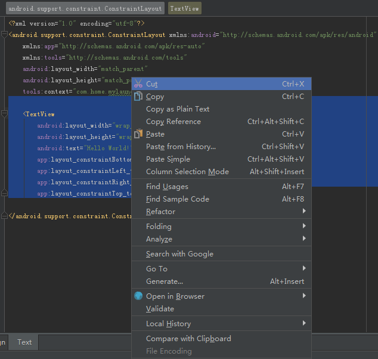

# Change the Manifest.xml to dismiss the Action-Bar

## Step 1
Create a new project, select to use 'Empty Activity'.

## Step 2
Delete the system-generated 'TextView', from 'activity_main.xml'
    

## Step 3
Change the layout to be 'Framelayout'
    

## Step 4
Delete the un-used name-space declaration.
    

## Step 5
Click 'preview' to see what it looks like now.
    
    

## Step 6
Open AndroidManifest.xml
    
    
## Step 7
Change the property of the MainActivity to dismiss the action-bar, by adding 'theme'.
    

## Step 8
Launch the emulator and check that there is no action-bar now.
    

## Step 9
Remove the 'theme' property in AndroidManifest.xml and run again. The emulator will show the action-bar.
    

## Back to [index](./index.md)
