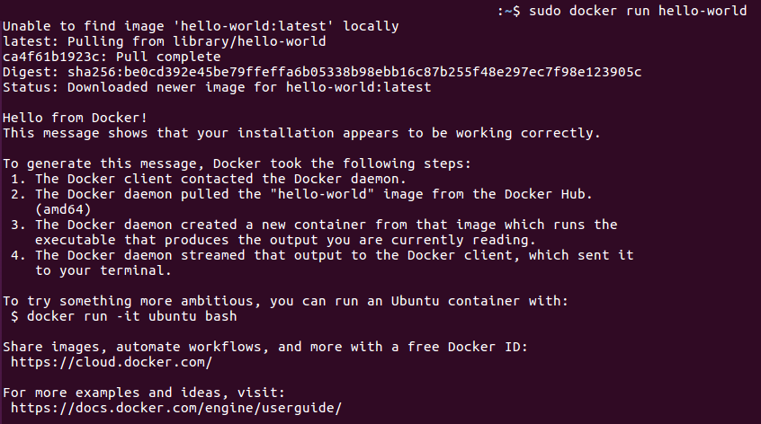

# Steps needed to install Docker CE on Ubuntu 16.04(64-bit)

Docker-CE uses overlay2 as the storage driver by default. For Ubuntu 16.04 and newer, no special actions needed.

There are three ways to install Docker.
- Install using repository
- Install using DEB package
- Install using automated convenience script

I decide to install using repository.

## Uninstall old version of Docker, if there is any
```shell
  sudo apt-get remove docker docker-engine docker.io
```
## Step 1: Set up the repository
Update the `apt` package index:
```shell
  sudo apt-get update
```

Install packages to allow `apt` use a reprository over HTTPS:
```shell
  sudo apt-get install apt-transport-https ca-certificates curl software-properties-common
```

Add Dcoker's official GPG key.
```shell
  curl -fsSL https://download.docker.com/linux/ubuntu/gpg | sudo apt-key add -
```

Verify the key.
```shell
  sudo apt-key fingerprint 0EBFCD88
```

Set up the stable repository.
```shell
  sudo add-apt-repository \
   "deb [arch=amd64] https://download.docker.com/linux/ubuntu \
   $(lsb_release -cs) \
   stable"
```

## Step 2: Install Docker CE
```shell
  sudo apt-get update
  sudo apt-get install docker-ce
```

## Step 3: Verify Docker installation
After installed, the Docker deamon will start automatically. Use below command to run the hello-world image.
```shell
  sudo docker run hello-world
```
And I see below output, which mean the installation is correct.



## References
- https://docs.docker.com/engine/installation/linux/docker-ce/ubuntu/

## Back to [index](./index.md)
