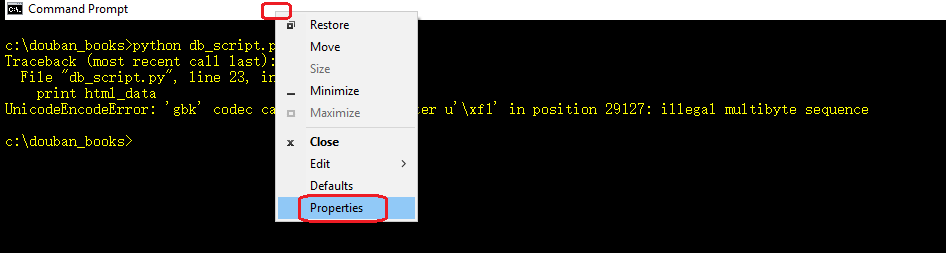
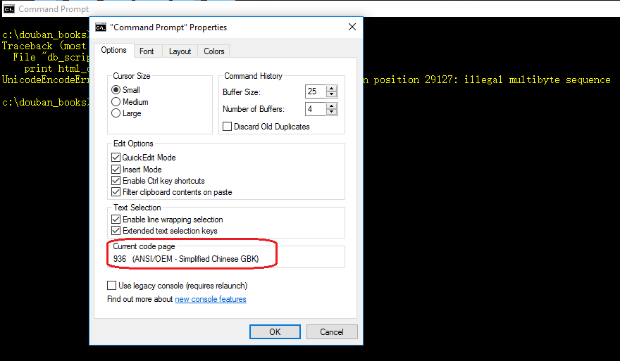
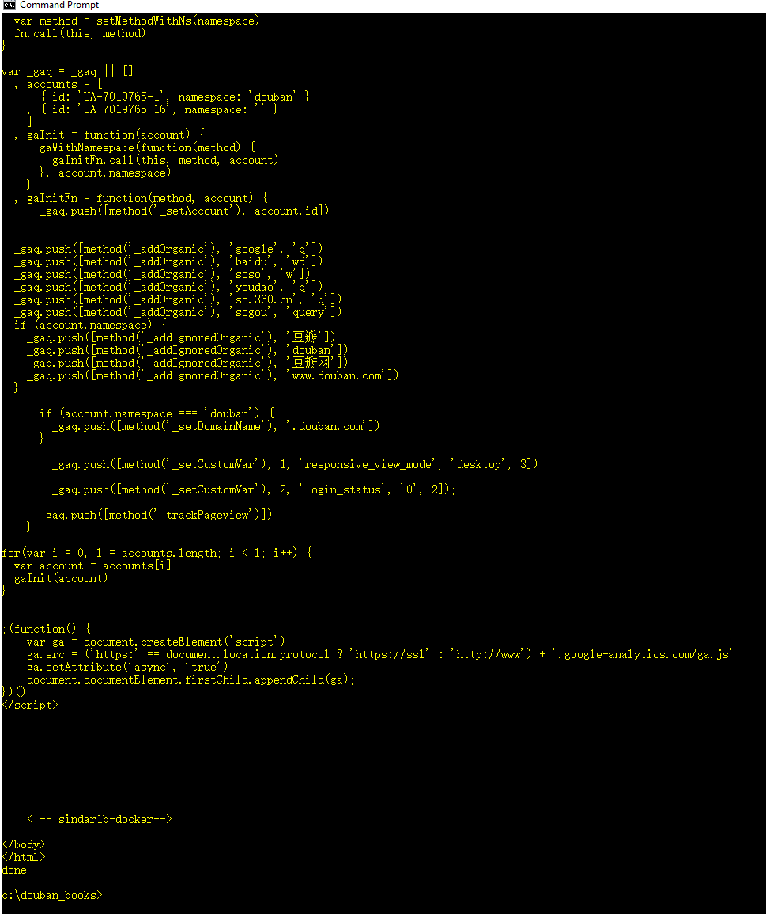

# Python爬取douban图书信息与趟坑笔记(二)

> 本系列记录了使用Python爬取douban图书信息的方式方法，以及个中的趟坑经验

上集说到，简简单单地请求了一个网页，就出错了~

## 为什么
我们先用浏览器打开https://book.douban.com/top250?start=0 查看源码。在页面的最上面几行，可以看到
```html
    <meta http-equiv="Content-Type" content="text/html; charset=utf-8">
```
对比python代码，我们确实是用utf-8进行解码的啊，没毛病！

## 那又是为什么
其实这不是python的锅，而是windows命令行的问题。在windows命令行的顶部点击鼠标右键，选择查看windows命令行的属性。





## 这是什么意思呢
我也不知道，肯定和utf-8以及'969'有关系~ </p>
嗯，就是这个过程了~~~

## 怎么解决
这个时候我们需要用到```sys```这个模块，于是先引入它。
```python
    import sys
```
然后修改代码如下:
```python
    # -*- coding: UTF-8 -*-

    from bs4 import BeautifulSoup
    import sys
    import urllib


    def get_html_text(url):
        '''
        Given url, query the page-content using this url
        '''
        try:
            resp = urllib.urlopen(url)
            html_data = resp.read().decode('utf-8')
            return html_data
        except:
            #just return empty-string if any failure.
            return ""

    if __name__ == "__main__":    
        url = "https://book.douban.com/top250?start=0"

        html_data = get_html_text(url)

        encode_type = sys.getfilesystemencoding()
        print html_data.encode(encode_type)

        print 'done'
```
再次运行，问题解决！



## References
- https://www.cnblogs.com/daxiong2014/p/5488383.html

## Back to [index](./index.md)
