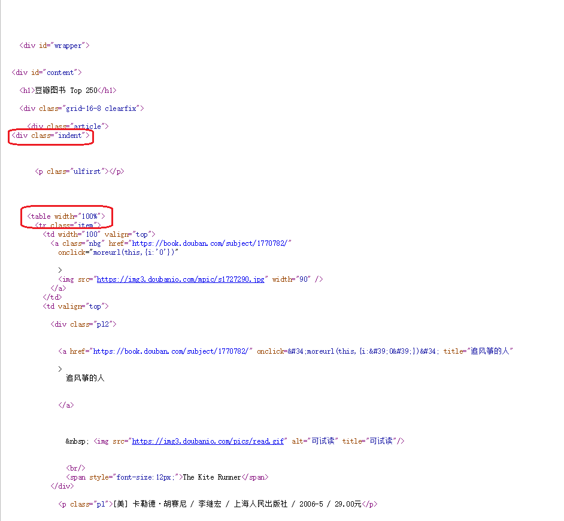
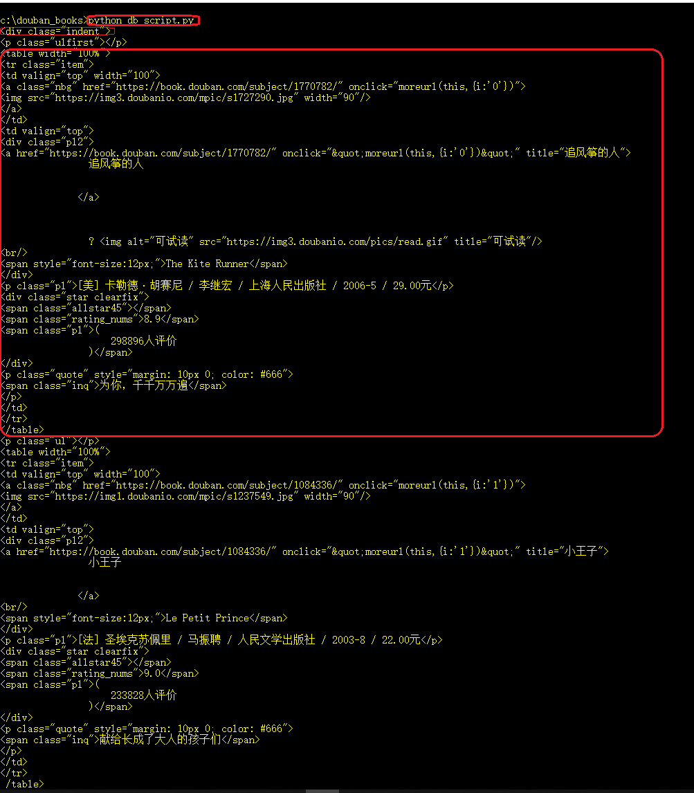
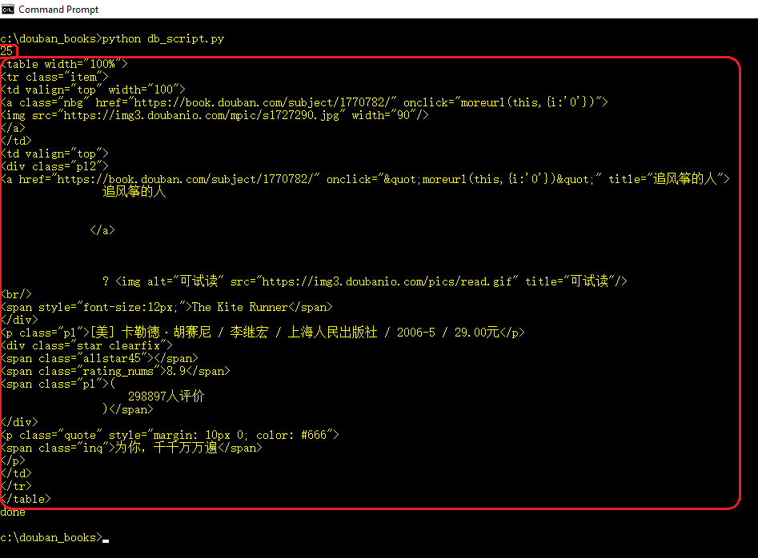
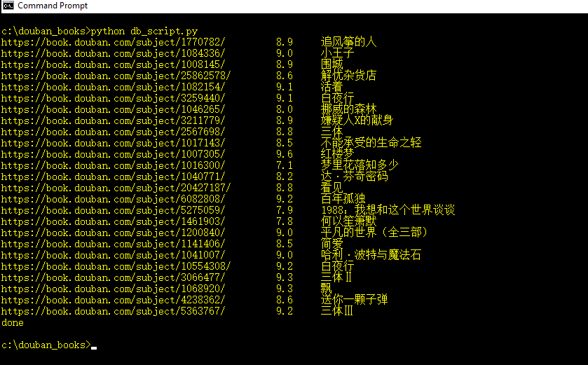

# Python爬取douban图书信息与趟坑笔记(三)

> 本系列记录了使用Python爬取douban图书信息的方式方法，以及个中的趟坑经验

上集中，我们解决了在windows命令行下，打印网页内容出错的问题，并成功打印出了网页的所有内容。

## 大致定位到我们关心的内容
查看 https://book.douban.com/top250?start=0 的源码，看看有没有什么特别的标签可以拿来进行定位。<br />
我们发现，书籍的信息似乎是用table来包含的。而在```<div class="indent">```之后，就开始了第一本书的信息。<br />
如何提取出这个div的内容呢？就要用到BeautifulSoup了。<br />
咱们先来构造一个查询条件。我们想要找什么东西？我们想要找到一个div,它的class是indent.于是，查询条件就构造出来了: ```soup.find('div',attrs={'class':'indent'})```



那么，我们就尝试着用这个```<div class="indent">```来定位一下。
```python
    # -*- coding: UTF-8 -*-

    from bs4 import BeautifulSoup
    import sys
    import urllib


    def get_html_text(url):
        '''
        Given url, query the page-content using this url
        '''
        try:
            resp = urllib.urlopen(url)
            html_data = resp.read().decode('utf-8')
            return html_data
        except:
            #just return empty-string if any failure.
            return ""

    if __name__ == "__main__":    
        url = "https://book.douban.com/top250?start=0"

        html_data = get_html_text(url)
        soup = BeautifulSoup(html_data,'html.parser')

        level_a = soup.find('div',attrs={'class':'indent'})

        encode_type = sys.getfilesystemencoding()
        print level_a.encode(encode_type)

        print 'done'
```

运行一下。嗯，我们成功地缩小了目标数据的范围。



## 抽取出书籍列表
既然每个table包含一本书的信息，那么我们把所有的table塞进一个数组，是不是就可以得到所有书籍的列表了呢？<br />
如何找到 **所有的** 东西？用find_all()啊！<br />
修改代码如下:

```python
    # -*- coding: UTF-8 -*-

    from bs4 import BeautifulSoup
    import sys
    import urllib


    def get_html_text(url):
        '''
        Given url, query the page-content using this url
        '''
        try:
            resp = urllib.urlopen(url)
            html_data = resp.read().decode('utf-8')
            return html_data
        except:
            #just return empty-string if any failure.
            return ""

    if __name__ == "__main__":    
        url = "https://book.douban.com/top250?start=0"

        html_data = get_html_text(url)
        soup = BeautifulSoup(html_data,'html.parser')

        level_a = soup.find('div',attrs={'class':'indent'})

        table_list = level_a.find_all('table')
        print len(table_list)

        encode_type = sys.getfilesystemencoding()
        print table_list[0].encode(encode_type)

        print 'done'
```



看运行结果，找到了25个table，刚好和页面上显示的书籍的数目相同。打印出的table_list的第一个元素的内容，又刚好是第一本书的内容，完美~

## 提取出我们需要的信息
现在粗数据(raw data)已经有了，我们只要对列表中的每个table，逐个进行分析，提取我们需要的内容就可以了。<br />
例如，对于每本书籍，我们想要获取如下的内容:

- 书名: 在class='pl2'(注意这里是小写的L，不是12345的1)的div里面,有一个a标签，它的属性title的值就是书名了。通过分析网页源码我们可以知道，div里面有且只有一个a标签，所以我们就不需要使用find_all()了。
- 书籍详细页面的地址: 还是这个a标签，它的href属性的值就是这本书的详情页面的链接地址
- 评分: 在一个class='rating_nums'的span里面，这个标签的内容就是书籍的评分
  
作为例子，我们就先读取这些信息吧。更详细的信息可以利用书籍详情页的链接地址，重复这个分析和提取过程来获得。
```python
    # -*- coding: UTF-8 -*-

    from bs4 import BeautifulSoup
    import sys
    import urllib


    def get_html_text(url):
        '''
        Given url, query the page-content using this url
        '''
        try:
            resp = urllib.urlopen(url)
            html_data = resp.read().decode('utf-8')
            return html_data
        except:
            #just return empty-string if any failure.
            return ""

    if __name__ == "__main__":    
        url = "https://book.douban.com/top250?start=0"

        html_data = get_html_text(url)
        soup = BeautifulSoup(html_data,'html.parser')

        level_a = soup.find('div',attrs={'class':'indent'})

        table_list = level_a.find_all('table')

        encode_type = sys.getfilesystemencoding()
        for table in table_list:
            #find the <a> tag to get book_name and book_detail_url
            a_div = table.find('div',attrs={'class':'pl2'})
            a_tag = a_div.find('a')
            book_name = a_tag.attrs['title'].encode(encode_type)
            book_detail_url = a_tag.attrs['href'].encode(encode_type)

            book_rating = table.find('span',attrs={'class':'rating_nums'}).text.encode(encode_type)

            #build the information into string and print
            str_tmp = "{0}\t {1}\t {2}".format(book_detail_url, book_rating, book_name)
            print str_tmp


        print 'done'
```



## 找找思路
1. 选择要爬取的目标网页
2. 查看目标网页的源码，确定要爬取信息的大致位置
3. 使用urllib将目标网页的内容请求回来，然后使用BeautifulSoup将目标数据初步提取出来
4. 在'raw data'中，精确定位目标数据并进行提取
5. 根据应用场景，将数据进行相应的保存、处理，或者利用提取出的数据构造出新的链接，进行进一步的数据提取

## 改进
例如，我们是不是可以把特定的分析代码放在函数里？是不是需要处理一些元素找不到之类的异常情况？是不是可以把提取的数据抽象成一个类？这个，根据不同的应用要求进行相应调整即可。

## Back to [index](./index.md)
