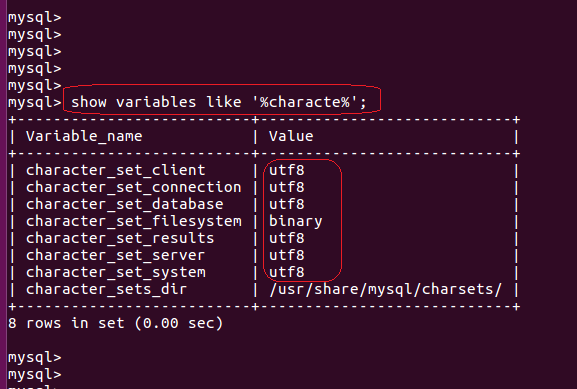
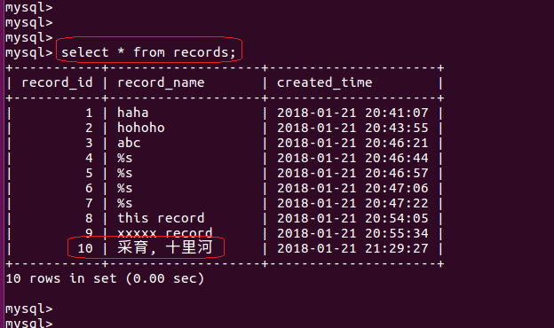

# 本文记录Python向MySql数据库插入中文数据时的坑，并填坑
> 上文演示了，使用Python向MySQL中插入中文数据时遇到错误。

## 检查MySQL服务器的配置
从MySQL服务器端查看，可以看到我们使用的已经是utf8编码的配置了。



## 检查Python脚本的内容
从我们的源码中显然可以看到，我们在Python脚本的第一行都声明了`# -*- coding: UTF-8 -*-`，因此我们可以在脚本中包含中文字符。

## 解决
1. 把我们Python脚本中的中文字符，解码成某种通用的形式.
2. 把这种通用的形式，使用utf-8进行编码. `str_1.decode('gbk').encode('utf-8')`
3. 把编码后的utf-8的内容，发送给MySQL服务器.
4. 服务器拿到内容后，根据自己的配置，想当然地认为，这些内容是utf-8的格式.
5. 于是，服务器使用utf-8的规则对数据进行检查.
6. 检查通过，入库.
7. 搞定.

```python
      # -*- coding: UTF-8 -*-
      import mysql.connector
      from mysql.connector import errorcode

      config = {
          'user' : 'xxx',
          'password' : 'xxx',
          'host' : 'xxx',
          'raise_on_warnings' : True,
          }

      DB_NAME = 'testdb'

      def create_database(cursor):
          '''
              Use the cursor to create the database
          '''
          try:
              cursor.execute(
                  "create database {} default character set 'utf8'".format(DB_NAME)
                  )
          except mysql.connector.Error as err:
              print "failed creating database:{}".format(err)
              exit(1)

      def create_table_records(cursor):
          '''
              Use the cursor to create the table
          '''
          TABLES = {}
          TABLES['records'] = (
              "CREATE TABLE `records` ("
              "  `record_id` int(11) NOT NULL AUTO_INCREMENT,"
              "  `record_name` varchar(14) NOT NULL,"
              "  `created_time` TIMESTAMP default CURRENT_TIMESTAMP,"
              "  PRIMARY KEY (`record_id`)"
              ") ENGINE=InnoDB DEFAULT CHARSET=utf8")
          try:
              cursor.execute(TABLES['records'])
          except mysql.connector.Error as err:
              print "failed creating table records:{}".format(err)
              exit(1)

      def insert_record(cursor):
          add_rec = "insert into records(record_name) values( 'token' )"

          str_1 = "采育, 十里河"
          cmd_str = add_rec.replace('token', str_1.decode('gbk').encode('utf-8'))

          cursor.execute(cmd_str)
          cnx.commit()

      if __name__ == "__main__":
          #connect to the server, doesn't specify the database to use
          cnx = mysql.connector.connect(**config)

          #get the cursor to use
          cursor = cnx.cursor()

          try:
              #switch to use the database
              cnx.database = DB_NAME
          except mysql.connector.Error as err:
              if err.errno == errorcode.ER_BAD_DB_ERROR:
                  #if we failed to switch to the database
                  #which means that it doesn't exist
                  #then we create it.
                  print "database not there, creating it..."
                  create_database(cursor)
                  cnx.database = DB_NAME
              else:
                  #some other error, just print it
                  print(err)
                  cursor.close()
                  cnx.close()
                  exit(1)

          #create_table_records(cursor)
          insert_record(cursor)
          #close the cursor
          cursor.close()
          cnx.close()

          print "Done"
```



## References
- MySQL Connector/Python: https://dev.mysql.com/doc/connector-python/en/

## Back to [index](./index.md)
