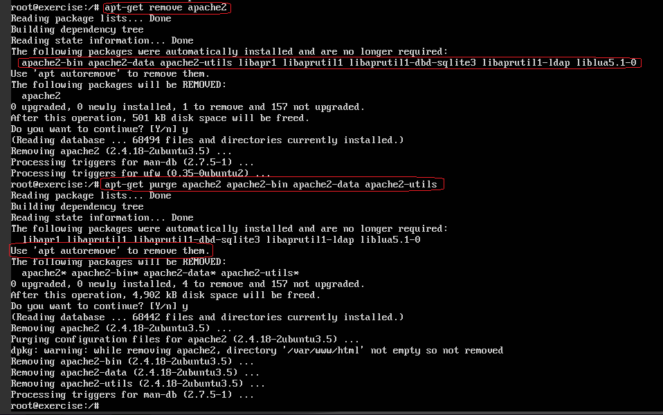
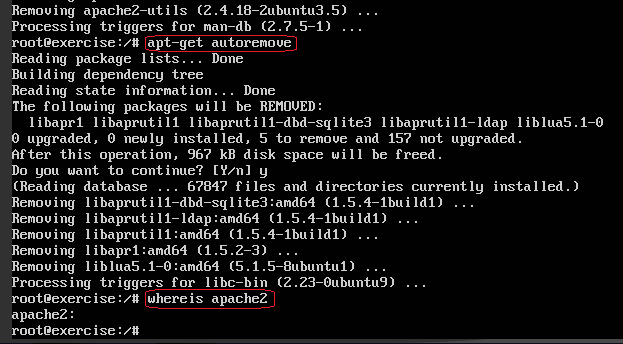
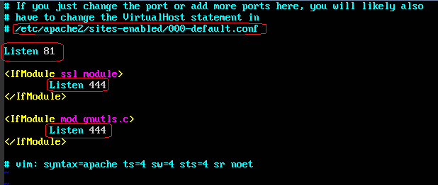
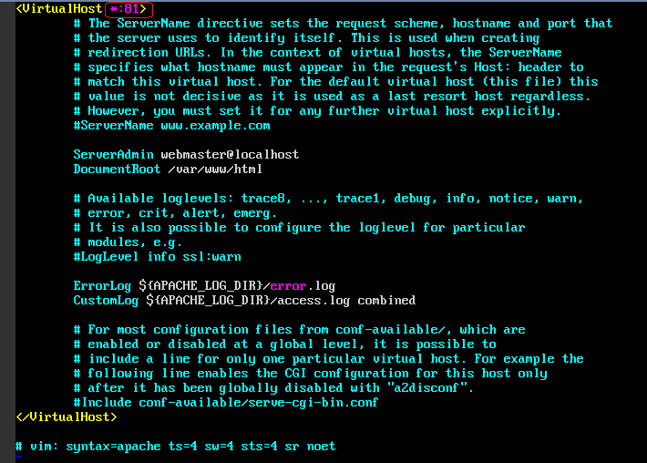
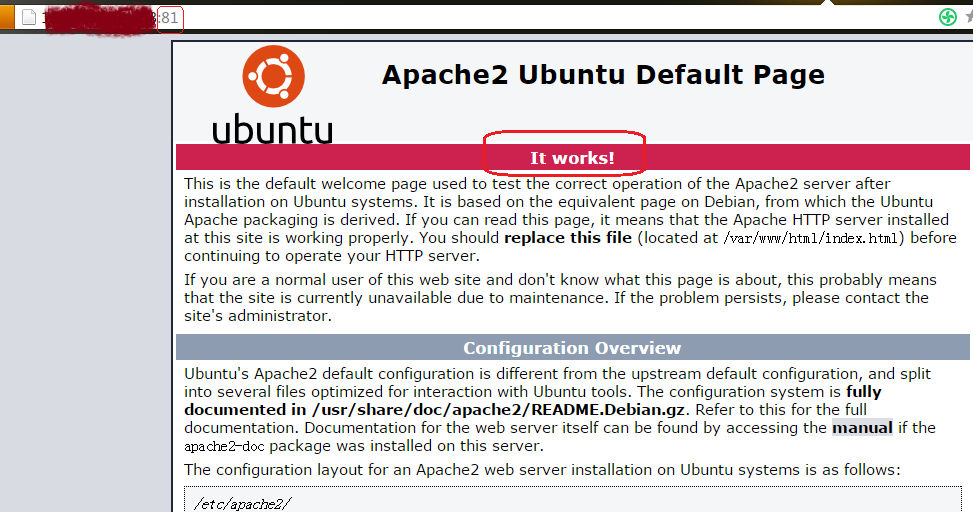

# How to remove and then install apache2 again on Ubuntu 16.04

## Remove apache2
Apache2 will not be properly removed when it is running.
```shell
  service apache2 stop
```
Then uninstall Apache2 and its dependent packages. 
Use **purge** option to remove dependent packages.
In addition, use autoremove option as well, to remove any other dependencies that were installed with Apache2, but are no longer used by any other package.
```shell
  apt-get remove apache2
  apt-get purge apache2 apache2-utils apache2-bin apache2-data
  (or apt-get purge apache*)
  apt-get autoremove
```

Finally, check if there is any configuration files or manual pages belonging to Apache2, which are still not removed.
```bash
  whereis apche2
```





Remove all the other contents not used any more.

## Install apache2
Install with command `apt-get install apache2` <br/>
Edit `/etc/apache2/ports.conf` to change 80-->81, 443-->444 <br/>



Edit `/etc/apache2/sites-enabled/000-default.conf`with 80-->81 <br/>



Use `service apache2 restart' to restart the service.

## Verify the installation
Access http://xxx.xxx.xxx.xxx:81/ to see the welcome page of apache2.



## References:
- http://xmodulo.com/how-to-uninstall-and-remove-apache2-on-ubuntu-debian.html
- http://www.linuxidc.com/Linux/2013-05/84312.htm

## Back to [index](./index.md)
